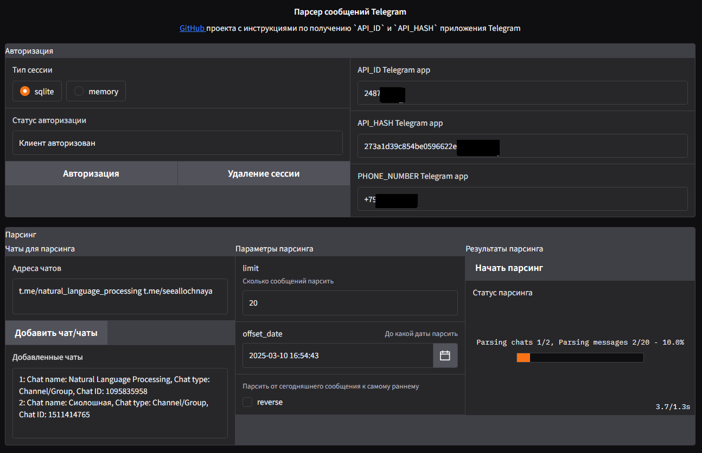
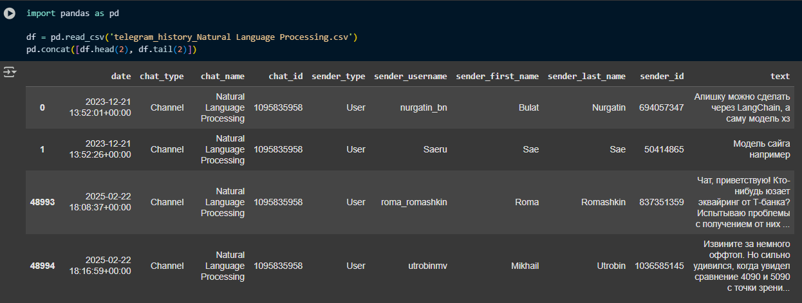
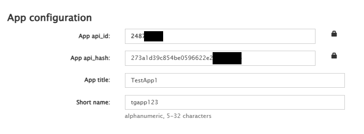

---
# Telegram Message Parser

Парсер сообщений Telegram на основе библиотеки Telethon

В Google Colab <a href="https://colab.research.google.com/drive/1sRmajP1fmTdN6WqxIWy1F7fBXSg4ZelD"></a> ноутбуке находится разбор кода парсера и пример чтения датасета результатов парсинга


---
## 📋 Содержание

- 🚀 [Функционал](#-Функционал)
- 🛠 [Стек технологий](#-Стек-технологий)
- ⚙️ [Подготовка к запуску](#-Подготовка-к-запуску)
- 🐍 [Запуск приложения](#-Запуск-приложения)
- 🔍 [Процесс парсинга](#-Процесс-парсинга)

---
## 🚀 Функционал

- Парсинг сообщений из групп / каналов / личных чатов и сохранение их в формат `csv`
- Настройки парсинга - кол-во загружаемых сообщений, дата, реверс
- Выбор типа сессии для авторизации


<details>
<summary>Скриншот окна интерфейса парсера</summary>


</details>

<details>
<summary>Скриншот датафрейма с результатами</summary>


</details>


---
## 🛠 Стек технологий

- [Python](https://www.python.org/) >= 3.10
- [Telethon](https://github.com/LonamiWebs/Telethon) для подключения к Telegram App API и парсинга сообщений
- [Gradio](https://github.com/gradio-app/gradio) для веб-интерфейса
- [Pandas](https://github.com/pandas-dev/pandas) для сохранения результатов парсинга в `csv`

Работоспособность приложения проверялась на следующих ОС и версиях Python
- Ubuntu 22.04, python 3.10.12
- Windows 10, python 3.12.2

Версии библиотек
```
gradio                             5.20.1
Telethon                           1.39.0
```


---
## ⚙️ Подготовка к запуску


**1) Клонирование репозитория**  
```
git clone https://github.com/sergey21000/telegram-message-parser.git
cd telegram-message-parser
```


**2) Регистрация приложения Telegram для получения `api_id` и `api_hash`**

Документация [Telegram](https://core.telegram.org/api/obtaining_api_id#obtaining-api-id) и документация [Telethon](https://docs.telethon.dev/en/stable/basic/signing-in.html#signing-in) по регистрации приложения и получению api_id и api_hash  

> [!IMPORTANT]  
> Не рекомендуется использовать основной аккаунт Telegram, лучше использовать другой, чтобы на случай блокировки не потерять доступ к важной информации

> [!IMPORTANT]  
> Если часто заходить и выходить в аккаунт Telegram, то при превышении лимита вход будет временно заблокирован  
[Инфо](https://docs.telethon.dev/en/stable/quick-references/faq.html#my-account-was-deleted-limited-when-using-the-library) по ограничениям аккаунта Telegram  
[Обсуждение](https://github.com/LonamiWebs/Telethon/issues/4051) почему выбивает из аккаунта Telegram

Процесс регистрации приложения:

1. Установить приложение [Telegram](https://telegram.org/), завести аккаунт, войти

2. Перейти на сайт https://my.telegram.org, ввести номер телефона и нажать `Next`, код подтверждения придет в приложение Telegram, ввести код подтверждения в окно

3. Нажать на [`API development tools`](https://my.telegram.org/apps) и зарегистрировать приложение  
Если процесс завершается ошибкой, то попробовать способы [отсюда](https://stackoverflow.com/questions/38104560/telegram-api-create-new-application-error/74973071#74973071)  

4. На странице [`API development tools`](https://my.telegram.org/apps) скопировать значения `App api_id` и `App api_hash`


<details>
<summary>Скриншот станицы созданного приложения Telegram</summary>


</details>


**3) Создание файла `.env` (опционально)**  
Записать полученные `api_id`, `api_hash` и номер телефона в файл `.env`  
Пример файла `.env`:
```
API_ID=12345678
API_HASH=273d1d39g853be059662re23af01f97b
PHONE_NUMBER=+79001112233
```
Данный шаг необязателен так как переменные можно ввести в интерфейс приложения, но он необходим чтобы не авторизовываться каждый раз при перезапуске приложения


---
## 🐍 Запуск приложения

**1) Создание и активация виртуального окружения (опционально)**

- *Linux*
  ```
  python3 -m venv env
  source env/bin/activate
  ```

- *Windows CMD*
  ```
  python -m venv env
  env\Scripts\activate
  ```

- *Windows PowerShell*
  ```
  python -m venv env
  env\Scripts\activate.ps1
  ```

**3) Установка зависимостей**  

```
pip install -r requirements.txt
```

**4) Запуск бота**  

- *Linux*
  ```
  python3 main.py
  ```

- *Windows*
  ```
  python main.py
  ```


---
## 🔍 Процесс парсинга

**1)** Если файл `.env` создан оттуда будут загружены переменные `api_id`, `api_hash` и номер телефона, если нет то нужно ввести их вручную  

**2)** Выбрать тип сессии:
- `sqlite` - сессия хранится в виде файла и сохраняется при перезапуске, удобно чтобы не авторизовываться каждый раз заново
- `memory` - сессия хранится в ОЗУ и удаляется при перезапуске приложения

**3)** Нажать кнопку `Авторизация`, и ввести код подтверждения, который будет отправлен в приложение Telegram, а затем облачный пароль если он установлен  
После успешной авторизации будет создан файл `telegram_api_session.session`, который позволяет не авторизовываться каждый раз при перезапуске приложения (при условии что выбран тип сессии `sqlite` и файл `.env` создан)

**4)** Ввести никнеймы или ID чатов для парсинга в поле через пробел, например 
- `t.me/natural_language_processing t.me/seeallochnaya`

Поддерживаемые форматы:
- `t.me/natural_language_processing`
- `@natural_language_processing`
- `natural_language_processing`
- `123456789` (ID чата/канала/группы)

**5)** Настройка параметров парсинга

- `limit` - сколько сообщений загружать
- `offset_date` - до какой даты загружать сообщения
- `reverse=False` - загружать последние `limit` сообщений (итерироваться от сегодняшней даты в прошлое)
- `reverse=True` - загружать первые `limit` сообщений (итерироваться от даты первого сообщения чата в настоящее)


## Лицензия

Этот проект лицензирован на условиях лицензии [MIT](./LICENSE).
